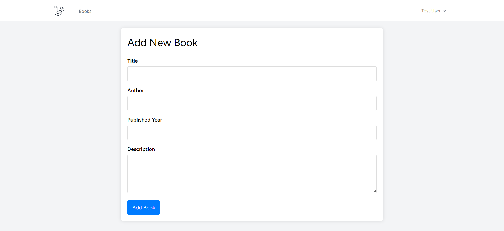
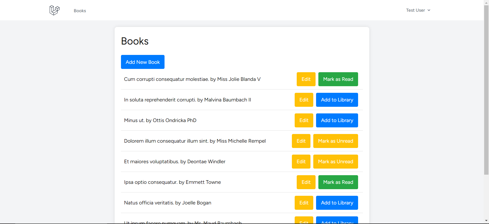
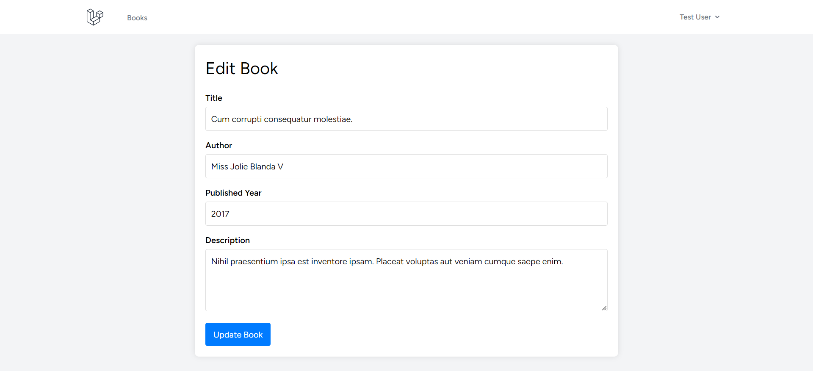
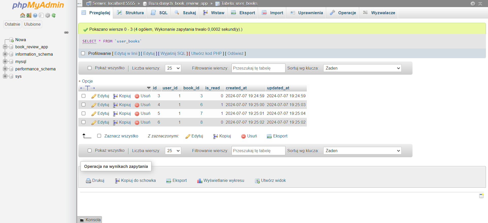
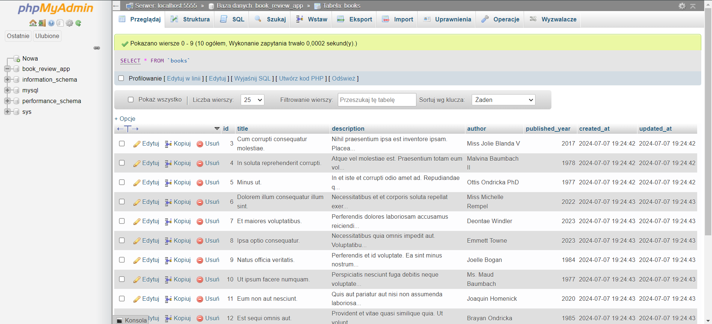

# BooksApp

BooksApp to aplikacja webowa stworzona w Laravel, która umożliwia użytkownikom zarządzanie ich biblioteką książek. Użytkownicy mogą dodawać książki do swojej biblioteki, oznaczać je jako przeczytane lub nieprzeczytane, edytować informacje o książkach oraz usuwać książki z biblioteki. Projekt skupia się na zarządzaniu relacjami w bazie danych, zapewniając pełne operacje CRUD (Create, Read, Update, Delete) na książkach.

## Relacje w Bazie Danych

Projekt BooksApp wykorzystuje relacje między tabelami w bazie danych, aby umożliwić zarządzanie książkami w kontekście użytkowników. Poniżej znajduje się opis relacji między tabelami oraz ich struktura.

### Struktura Bazy Danych

1. **Tabela `users`**
    - `id`: unikalny identyfikator użytkownika (primary key)
    - `name`: nazwa użytkownika
    - `email`: email użytkownika
    - `password`: zaszyfrowane hasło użytkownika
    - `created_at`: timestamp utworzenia użytkownika
    - `updated_at`: timestamp ostatniej aktualizacji użytkownika

2. **Tabela `books`**
    - `id`: unikalny identyfikator książki (primary key)
    - `title`: tytuł książki
    - `description`: opis książki
    - `author`: autor książki
    - `published_year`: rok wydania książki
    - `created_at`: timestamp utworzenia książki
    - `updated_at`: timestamp ostatniej aktualizacji książki

3. **Tabela `user_books`**
    - `id`: unikalny identyfikator rekordu (primary key)
    - `user_id`: identyfikator użytkownika (foreign key do `users`)
    - `book_id`: identyfikator książki (foreign key do `books`)
    - `is_read`: boolean oznaczający, czy książka została przeczytana
    - `created_at`: timestamp utworzenia rekordu
    - `updated_at`: timestamp ostatniej aktualizacji rekordu

### Relacje w Eloquent ORM

1. **User**
    - `books()`: relacja wiele do wielu z tabelą `books` za pośrednictwem tabeli `user_books`.
    
    ```php
    public function books()
    {
        return $this->belongsToMany(Book::class, 'user_books')->withPivot('is_read')->withTimestamps();
    }
    ```

2. **Book**
    - `users()`: relacja wiele do wielu z tabelą `users` za pośrednictwem tabeli `user_books`.
    
    ```php
    public function users()
    {
        return $this->belongsToMany(User::class, 'user_books')->withPivot('is_read')->withTimestamps();
    }
    ```

## Funkcjonalności

- Dodawanie książek do biblioteki
- Oznaczanie książek jako przeczytane lub nieprzeczytane
- Edytowanie informacji o książkach
- Usuwanie książek z biblioteki

## Instalacja

1. Sklonuj repozytorium:
    ```sh
    git clone git@github.com:your-username/BooksApp.git
    ```

2. Przejdź do katalogu projektu:
    ```sh
    cd BooksApp
    ```

3. Zainstaluj zależności:
    ```sh
    composer install
    npm install
    ```

4. Skonfiguruj plik `.env`:
    ```sh
    cp .env.example .env
    php artisan key:generate
    ```

5. Uruchom migracje:
    ```sh
    php artisan migrate
    ```

6. Uruchom serwer deweloperski:
    ```sh
    php artisan serve
    ```

## Przykłady Screenshotów

### Dodawanie książki


### Lista książek


### Edycja książki


### Tabela 'user_books'


### Tabela 'books'


